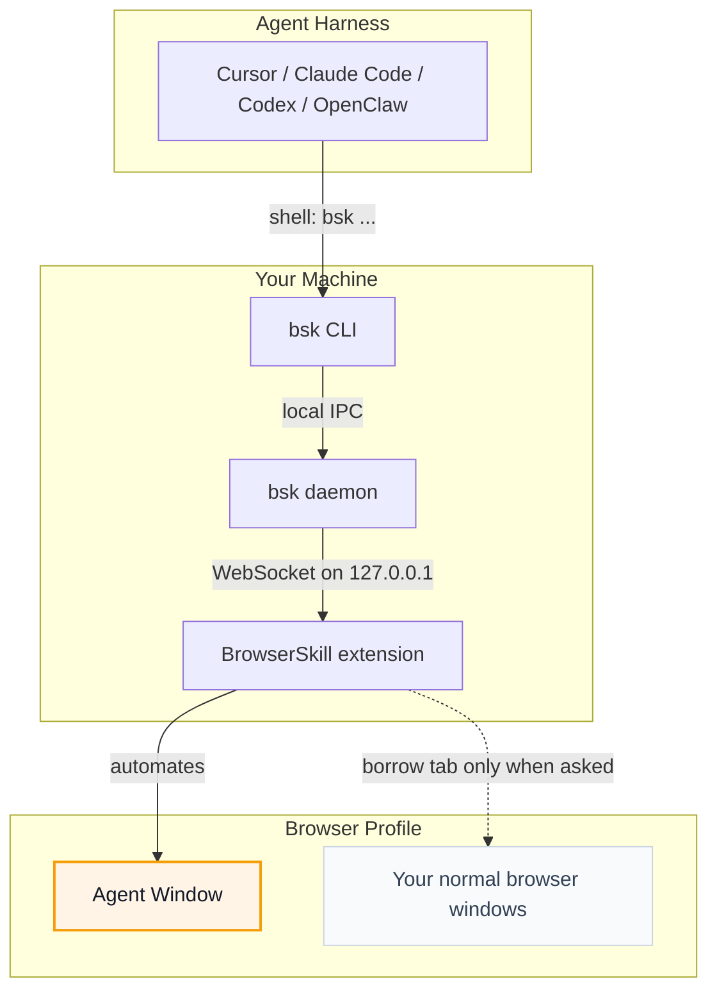

# BrowserSkill

<p align="center">
  
</p>

<p align="center">
  <strong>Let AI agents use your browser without interrupting your work.</strong>
</p>

<p align="center">
  English · <a href="README.zh-CN.md">中文</a>
</p>

**BrowserSkill** connects Cursor, Claude Code, Codex, OpenClaw, CodeBuddy,
WorkBuddy, Pi, Hermes Agent, DeepSeek Harness, and other AI agents to your already logged-in
browser.

Need the agent to touch a tab you already have open? It must borrow that tab
explicitly, return it when the task is done, and leave the rest of your browser
alone.

https://github.com/user-attachments/assets/db782c92-b1d4-4aae-a255-039675937a90

## BrowserSkill Advantages

- **Reuse real login state**: Agents can work with sites you are already signed
  into, without separate test accounts.
- **Keep working uninterrupted**: browser tasks run in a separate, visible
  Agent Window, so you can keep using your own browser.
- **Explicitly control the current tab**: `bsk session start --attach-current-tab`
  fixes the session to the tab active at start. Restricted internal pages create
  an `about:blank` work tab in the same window and report
  `fallback_created=true`. `bsk tab create` can create and rebind another work
  tab; the original tab and window are preserved.
- **Support any Agent**: any Agent that can call a shell can use BrowserSkill
  through the `bsk` CLI, with no lock-in to a specific model, Agent framework, or
  harness.
- **Built-in human-in-loop**: when a task hits captcha, login, confirmation
  dialogs, or other human-only steps, the Agent can ask you to take over and
  then continue afterwards.

## Runtime Environment

BrowserSkill has two local runtime pieces: the `bsk` CLI/daemon and the browser
extension.

| Runtime | Support |
| --- | --- |
| Operating systems | macOS (Apple Silicon and Intel), Linux (x64 and ARM64), Windows x64 |
| Browsers | Chrome and Microsoft Edge are supported; other Chromium-based browsers are expected to work when they support unpacked Chromium extensions; Firefox is planned |

## Quick Start

<details open>
<summary><b>Install with your Agent (recommended)</b></summary>

<br>

Already using Cursor, Claude Code, Codex, or another shell-capable agent? Just
copy this one line and send it to your agent — it will install the CLI and skill
for you, then walk you through loading the extension:

```text
Set up browser-skill on this machine by following https://raw.githubusercontent.com/Tencent/BrowserSkill/main/AGENT_INSTALL.md
```

</details>

<details>
<summary><b>Manual install</b></summary>

<br>

Install the CLI, then install the extension from the [Chrome Web Store](https://chromewebstore.google.com/detail/hhcmgoofomhgciiibhipgmgkgnoenaoi)
or [Edge Add-ons](https://microsoftedge.microsoft.com/addons/detail/browserskill/emacgiaaaiojkkpkddmmdfhmokgmnikg).

#### 1. Install the `bsk` CLI

**macOS / Linux** (recommended — installs to `~/.local/bin`):

```bash
curl -fsSL https://raw.githubusercontent.com/Tencent/BrowserSkill/main/install.sh | sh
```

**Windows** (PowerShell — installs to `~/.local/bin`):

```powershell
irm https://raw.githubusercontent.com/Tencent/BrowserSkill/main/install.ps1 | iex
```

Verify the binary:

```bash
bsk --version
```

#### 2. Install the browser extension

Install BrowserSkill from your browser's store:

| Browser | Store listing |
| --- | --- |
| Chrome | [Chrome Web Store](https://chromewebstore.google.com/detail/hhcmgoofomhgciiibhipgmgkgnoenaoi) |
| Microsoft Edge | [Edge Add-ons](https://microsoftedge.microsoft.com/addons/detail/browserskill/emacgiaaaiojkkpkddmmdfhmokgmnikg) |

On other Chromium-based browsers, install the Chrome Web Store build.

#### 3. Install the skill

BrowserSkill ships a skill that teaches your agent harness how to use `bsk`. For
these harnesses, install it in one step:

<p align="center">
<table>
  <tr>
    <td align="center" width="108"><a href="https://cursor.com" title="Cursor"></a><br /><sub><b>Cursor</b></sub></td>
    <td align="center" width="108"><a href="https://docs.anthropic.com/en/docs/claude-code" title="Claude Code"></a><br /><sub><b>Claude Code</b></sub></td>
    <td align="center" width="108"><a href="https://developers.openai.com/codex" title="Codex"></a><br /><sub><b>Codex</b></sub></td>
    <td align="center" width="108"><a href="https://openclaw.ai" title="OpenClaw"></a><br /><sub><b>OpenClaw</b></sub></td>
    <td align="center" width="108"><a href="https://www.codebuddy.ai" title="CodeBuddy"></a><br /><sub><b>CodeBuddy</b></sub></td>
    <td align="center" width="108"><a href="https://www.workbuddy.ai" title="WorkBuddy"></a><br /><sub><b>WorkBuddy</b></sub></td>
    <td align="center" width="108"><a href="https://github.com/badlogic/pi-mono" title="Pi"></a><br /><sub><b>Pi</b></sub></td>
    <td align="center" width="108"><a href="https://github.com/NousResearch/hermes-agent" title="Hermes Agent"></a><br /><sub><b>Hermes Agent</b></sub></td>
  </tr>
</table>
</p>

```bash
bsk install-skill
```

Use <kbd>Space</kbd> to select the Agent harness you want to install into, then
press <kbd>Enter</kbd> to install the skill. Run `bsk install-skill --list` to see
internal variants and install paths.

To install your own instructions, use `bsk install-skill --harness cursor --source ./SKILL.md`.
An explicit `--source` stays custom even if its contents match the bundled skill.
Existing installations are skipped unless you add `--force`.

Daemon startup, `session start`, and `doctor` automatically update managed skills
only when their contents still match the last installed version. Local edits are
preserved and automatic updates pause. An older installation without a content
baseline is enrolled automatically only if it exactly matches the current bundled
skill; this writes the source marker without rewriting `SKILL.md`. Explicit custom
installations stay custom even when their contents match.

For differing historical files, local edits, or an unrecognized source marker,
`doctor` shows `WARN` with the reason and recovery options. These warnings do not
make the health check fail (`--json` reports `status: "warn"` and `ok: true`).
A concurrent install or sync is reported as deferred and retried on a later pass.

To keep your current instructions as an explicit customization, run
`bsk install-skill --harness cursor --source <existing-SKILL.md> --force`, replacing
`<existing-SKILL.md>` with the path to your existing file. To restore the bundled
skill and resume automatic updates, run `bsk install-skill --harness cursor --force`
without `--source`. This second command overwrites the existing instructions.

Other shell-capable agent harnesses are supported too. Copy
[`skill/SKILL.md`](skill/SKILL.md) into your harness's skills directory as
`browser-skill/SKILL.md` to install the skill manually. DeepSeek Harness uses a
dedicated plugin instead — see [DeepSeek Harness plugin](#deepseek-harness-plugin).

</details>

Start a new Agent session and write a prompt that needs the browser, for example:

```text
/browser-skill open example.com and summarize what is on the page.
```

## DeepSeek Harness plugin

Using [DeepSeek Harness](https://github.com/deepseek-ai/deepseek-harness) (`dsh`)?
BrowserSkill ships a first-class dsh plugin on npm as
[`@wxg-prc-cpg/browser-skill-dsh-plugin`](https://www.npmjs.com/package/@wxg-prc-cpg/browser-skill-dsh-plugin).
It gives the agent native `browser_*` tools and a live view of its browser sessions
in the Web UI. The plugin runs `bsk` on the agent's behalf.

Install the `bsk` CLI and connect the browser extension first. Then add the plugin
to a dsh profile and start it (replace `web` with your profile name):

```sh
dsh plugin --profile web add @wxg-prc-cpg/browser-skill-dsh-plugin
dsh --profile web
```

The plugin includes the `browser-skill` skill, so `bsk install-skill` is not needed
for dsh. Installed plugins do not update automatically. To upgrade this plugin:

```sh
dsh plugin --profile web update @wxg-prc-cpg/browser-skill-dsh-plugin --latest
```

Restart the profile after upgrading. See the
[plugin README](packages/dsh-plugin-browserskill/README.md) for usage and configuration.

## How It Works

BrowserSkill is a local bridge between your agent harness and your browser.



The agent never talks to the browser directly. It asks the `bsk` CLI to perform a
browser task; the local daemon routes that request to the extension; the
extension runs it in an Agent Window or an explicitly attached current tab. DeepSeek Harness takes the same path
through the [plugin](#deepseek-harness-plugin): the agent calls injected
`browser_*` tools, and the plugin invokes `bsk` on its behalf.

## For Developers

The [scroll-to primitive reference](docs/scroll-to.md) covers its CLI, protocol
and plugin entry points, visible bounds and interruption behavior.

The repository is a Cargo + pnpm workspace:

- `crates/bsk-cli` — `bsk` CLI and local daemon
- `crates/bsk-protocol` — shared wire types and JSON schemas
- `apps/extension` — browser extension
- `packages/ui` and [`packages/i18n`](packages/i18n/README.md) — shared extension UI support, including English, Simplified Chinese and Korean localization
- `packages/dsh-plugin-browserskill` — DeepSeek Harness plugin (`@wxg-prc-cpg/browser-skill-dsh-plugin`)
- [`evals/browser`](evals/browser/README.md) — deterministic local pages and agent-neutral browser capability evaluation

## License

MIT
