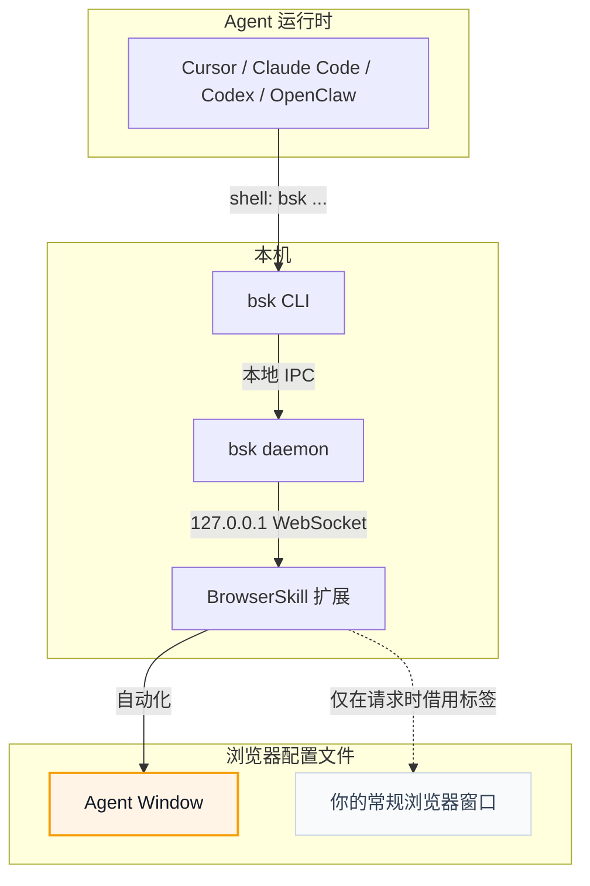

# BrowserSkill

<p align="center">
  
</p>

<p align="center">
  <strong>让 AI Agent 操作你的浏览器，而不打断你的工作。</strong>
</p>

<p align="center">
  <a href="README.md">English</a> · 中文
</p>

**BrowserSkill** 把 Cursor、Claude Code、Codex、OpenClaw、CodeBuddy、WorkBuddy、Pi、Hermes Agent、DeepSeek Harness 等 AI Agent 连接到你已登录的浏览器。

需要 Agent 操作你已打开的标签页？必须显式借用该标签，任务结束后归还，其余浏览器窗口不受影响。

https://github.com/user-attachments/assets/db782c92-b1d4-4aae-a255-039675937a90

## BrowserSkill 的优势

- **复用真实登录态**：Agent 可以操作你已经登录的网站，不需要额外测试账号。
- **不中断你的工作**：浏览器任务在独立可见的 Agent Window 中运行，不影响你继续使用自己的浏览器。
- **可显式接管当前标签页**：使用 `bsk session start --attach-current-tab` 时固定接管启动瞬间的活动标签页；若它是 `chrome://`、扩展页等受限页面，会在同一窗口创建 `about:blank` 工作标签页并返回 `fallback_created=true`。`bsk tab create` 可继续创建工作标签页并将会话重绑定到新 tab；原标签页与窗口都会保留。此模式仅用于本地连接；远程任务使用独立 Agent Window，并通过 `tab borrow` 显式授权。
- **支持任意 Agent**：只要 Agent 能调用 Shell，就可以通过 `bsk` CLI 使用 BrowserSkill，不绑定特定模型、Agent 框架或 harness。
- **内置 human-in-loop**：遇到 captcha、登录、确认弹窗等必须由人处理的步骤时，Agent 可以主动请求你接管，完成后再继续任务。

可以在插件的 **快捷功能 → 长截图** 中截取长图，也可以让 Agent 调用
`bsk screenshot --session <id> --full-page --out page.png`。
默认采集与编码超时为两分钟，长页面可加 `--timeout 5m`；支持 Ctrl-C 取消，结束后恢复原始滚动位置。
需要使用同一版本的 CLI 和扩展，详见[长截图说明](docs/long-screenshot.md)。

## 运行环境

BrowserSkill 由两个本地运行组件组成：`bsk` CLI/daemon 和浏览器扩展。

| 运行项 | 支持情况 |
| --- | --- |
| 操作系统 | macOS（Apple Silicon 和 Intel）、Linux（x64 和 ARM64）、Windows x64 |
| 浏览器 | 已支持 Chrome 和 Microsoft Edge；其他支持加载 Chromium 扩展的浏览器通常可用；Firefox 计划中 |

## 快速开始

如果 Agent 沙盒会在每条命令结束后回收后台进程，请先阅读
[沙盒环境配置说明](docs/sandboxed-agents.md)：在宿主侧保持 daemon 存活，
沙盒内通过共享的 `BSK_HOME` 和 `BSK_AUTO_START=0` 连接。
普通本地环境仍默认自动启动，无需额外配置。

<details open>
<summary><b>让 Agent 帮你安装（推荐）</b></summary>

<br>

已经在用 Cursor、Claude Code、Codex 或其他支持 Shell 的 Agent？只需复制下面这句话发给 Agent，它会帮你安装 CLI 和 skill，并引导你加载浏览器扩展：

```text
按照 https://raw.githubusercontent.com/Tencent/BrowserSkill/main/AGENT_INSTALL.md 的说明，在本机安装并配置 browser-skill
```

</details>

<details>
<summary><b>手动安装</b></summary>

<br>

先安装 CLI，再从 [Chrome Web Store](https://chromewebstore.google.com/detail/hhcmgoofomhgciiibhipgmgkgnoenaoi)
或 [Edge 加载项商店](https://microsoftedge.microsoft.com/addons/detail/browserskill/emacgiaaaiojkkpkddmmdfhmokgmnikg) 安装浏览器扩展。

#### 1. 安装 `bsk` CLI

**macOS / Linux**（推荐，安装到 `~/.local/bin`）：

```bash
curl -fsSL https://raw.githubusercontent.com/Tencent/BrowserSkill/main/install.sh | sh
export PATH="${BSK_INSTALL_DIR:-$HOME/.local/bin}:$PATH"
```

**Windows**（PowerShell，安装到 `~/.local/bin`）：

```powershell
irm https://raw.githubusercontent.com/Tencent/BrowserSkill/main/install.ps1 | iex
```

上面的 export 让当前 Unix shell 能找到 CLI。正在运行的 Agent 可能需要在每次 Shell
调用中设置同样的 PATH，或使用安装后二进制的绝对路径。如果 Agent 安装后仍沿用旧 PATH，请重启 Agent。

在实际使用工具的终端或 Agent 环境中验证二进制：

```bash
bsk --version
```

#### 2. 安装浏览器扩展

在对应浏览器的商店安装 BrowserSkill：

| 浏览器 | 商店页面 |
| --- | --- |
| Chrome | [Chrome Web Store](https://chromewebstore.google.com/detail/hhcmgoofomhgciiibhipgmgkgnoenaoi) |
| Microsoft Edge | [Edge 加载项商店](https://microsoftedge.microsoft.com/addons/detail/browserskill/emacgiaaaiojkkpkddmmdfhmokgmnikg) |

其他基于 Chromium 的浏览器，安装 Chrome Web Store 版本即可。

#### 3. 安装 skill

BrowserSkill 自带 skill，用于教 Agent harness 如何使用 `bsk`。以下 harness 可一键安装：

<p align="center">
<table>
  <tr>
    <td align="center" width="108"><a href="https://cursor.com" title="Cursor"></a><br /><sub><b>Cursor</b></sub></td>
    <td align="center" width="108"><a href="https://docs.anthropic.com/en/docs/claude-code" title="Claude Code"></a><br /><sub><b>Claude Code</b></sub></td>
    <td align="center" width="108"><a href="https://developers.openai.com/codex" title="Codex"></a><br /><sub><b>Codex</b></sub></td>
    <td align="center" width="108"><a href="https://openclaw.ai" title="OpenClaw"></a><br /><sub><b>OpenClaw</b></sub></td>
    <td align="center" width="108"><a href="https://www.codebuddy.ai" title="CodeBuddy"></a><br /><sub><b>CodeBuddy</b></sub></td>
    <td align="center" width="108"><a href="https://www.workbuddy.ai" title="WorkBuddy"></a><br /><sub><b>WorkBuddy</b></sub></td>
    <td align="center" width="108"><a href="https://github.com/badlogic/pi-mono" title="Pi"></a><br /><sub><b>Pi</b></sub></td>
    <td align="center" width="108"><a href="https://github.com/NousResearch/hermes-agent" title="Hermes Agent"></a><br /><sub><b>Hermes Agent</b></sub></td>
  </tr>
</table>
</p>

```bash
bsk install-skill
```

用 <kbd>Space</kbd> 选择需要安装的 Agent harness，然后按 <kbd>Enter</kbd> 安装 skill。运行 `bsk install-skill --list` 可查看 internal 变体及安装路径。

非交互安装时显式指定目标 harness，例如 `bsk install-skill --harness cursor --json`。
即使未检测到该 harness，也可显式选择。单独使用 `--yes` 会安装到所有检测到的 harness，
一个也未检测到时会报错。

安装自定义指令可运行 `bsk install-skill --harness cursor --source ./SKILL.md`。
显式指定 `--source` 的安装始终视为自定义，即使内容与内置 skill 相同。
已有安装默认跳过，添加 `--force` 才会覆盖。

daemon 启动、`session start` 和 `doctor` 会检查已安装的 skill：只有文件内容仍与
上次安装或同步时的内容一致，才继续自动更新。检测到本地编辑时会保留文件并暂停更新。
没有内容基线的历史安装，只有与当前内置 skill 字节级一致时才自动纳入管理；此时只补齐
来源标记，不重写 `SKILL.md`。明确的自定义安装即使内容相同，也不会被自动纳入管理。

对于内容不同的历史文件、本地编辑或无法识别的来源标记，`doctor` 会显示 `WARN`，
说明暂停原因及恢复方法。这类警告不会让健康检查失败（`--json` 中为 `status: "warn"`、
`ok: true`）。其他安装或同步正在进行时，本次同步会推迟到后续再试。

如需将当前指令保留为明确的自定义安装，运行
`bsk install-skill --harness cursor --source <existing-SKILL.md> --force`，将
`<existing-SKILL.md>` 替换为现有文件路径。如需恢复内置 skill 并重新启用自动更新，运行
`bsk install-skill --harness cursor --force`，不带 `--source`。后一条命令会覆盖现有指令。

其他支持 Shell 的 Agent harness 也可使用 BrowserSkill，但需手动将 [`skill/SKILL.md`](skill/SKILL.md) 复制到对应 skills 目录下的 `browser-skill/SKILL.md`。DeepSeek Harness 走独立插件，见 [DeepSeek Harness 插件](#deepseek-harness-插件)。

#### 4. 验证连接

运行 `bsk doctor` 并按提示处理，打开扩展弹窗确认已连接。测试浏览器操作前，说明警告并解决失败项。
未安装任何 skill 时，doctor 仍可能通过（该项为 `N/A`）；skill 是否被发现需要单独验证。

</details>

启动一个新的 Agent 会话，确认 harness 中可用 `browser-skill`，再让它打开
`https://example.com` 并总结页面。对于支持斜杠命令调用 skill 的 harness，例如：

```text
/browser-skill open example.com and summarize what is on the page.
```

首次使用验证应成功读取页面，并停止本次 BrowserSkill session。
如果找不到 skill，先检查目标 harness 和安装路径，再重试。

### 升级

默认本地配置下，先结束正在执行的浏览器任务，再更新：

```sh
bsk update --yes
```

如果 Windows 提示更新已暂存（staged），请等待替换完成后再检查 `bsk --version`。

该命令安装新版本时，会以默认启动配置重启正在运行的 daemon。
如果通过安装脚本替换了二进制，则在任务结束后运行 `bsk daemon restart`，重启已有 daemon。

对于自定义端口、宿主管理的沙盒 daemon 或远程服务器，先在所属宿主环境或进程管理器中停止 daemon，
运行 `bsk update --yes --no-restart-daemon`，再以原有参数和 `BSK_HOME` 在那里启动。
维护期间，在 Agent 命令中设置 `BSK_AUTO_START=0`；详见[沙盒](docs/sandboxed-agents.md)和
[远程连接](docs/remote-extension-connection.md)配置说明。

通过浏览器商店更新扩展；开发时加载的解压版本需要重新构建并重新加载。
商店版本可能晚于 CLI 上线。使用 `bsk --version` 和 `bsk status` 核对 CLI、daemon 和扩展版本，
再运行 `bsk doctor`。长截图等新功能需要匹配的版本。
[DSH 插件需要单独更新](#deepseek-harness-插件)，并重启对应 profile。
受管理的 CLI skill 会在 daemon 启动、`session start` 或 `doctor` 时同步；本地编辑和自定义 skill 会保留。
启动新的 Agent 会话以加载更新后的指令。

**升级到 0.3.0：** `--unattended`、`tab borrow --no-confirm` 和 `BSK_REQUEST_HELP=off`
不再跳过确认或关闭人工协助。请在扩展中选择下文说明的对应设置。版本变化见[更新日志](CHANGELOG.md)。

### 自动化设置与无人值守

插件弹窗提供两个默认开启的独立设置。**用户在插件中保存的设置对所有会话具有最终决定权：**

| 借用标签页前确认 | 允许请求人工协助 | 实际行为 |
| --- | --- | --- |
| 开 | 开 | 借用需要确认；求助正常弹窗。 |
| 开 | 关 | 借用需要确认；求助返回 `disabled`。 |
| 关 | 开 | 借用免确认；求助正常弹窗。 |
| 关 | 关 | 借用免确认；求助返回 `disabled`。 |

设置自动保存到当前浏览器配置，对已有和新建会话生效。关闭借用确认会放行待确认请求；
关闭人工协助会将等待中的求助结束为 `disabled`。重新打开开关后，后续操作恢复对应行为，
包括通过旧参数 `--unattended` 创建的会话。已完成的借用不会撤销，已结束的求助不会重新弹出。
允许人工协助意味着 `request-help` 可用，不代表每个浏览器操作都必须先请求许可；任务授权和宿主审批仍然有效。

正常使用 `bsk session start`；需要后台打开 Agent Window 时添加 `--no-focus`。
无人值守由用户在插件中关闭相应开关。`--unattended`、`tab borrow --no-confirm`、
`BSK_REQUEST_HELP=off` 保留兼容识别，但已弃用，不能覆盖插件开关。CLI 使用这些输入时会输出说明，
Daemon 也会为自身继承的旧环境设置记录说明。原先只依靠这些输入避免等待的脚本，现在需要遵循浏览器设置。
`session start --json` 和 `session list --json` 返回浏览器实际的 `interaction` 策略。

关闭人工协助后，`request-help` 返回 `disabled`，不代表用户已完成操作。技能会引导 Agent
重新观察页面，利用现有登录态、已授权输入和可用工具尽力完成已授权的步骤。
任务授权和宿主规则允许时，具备视觉能力的模型可以尝试图形验证。手机扫码、人脸验证、
无法获取的短信验证码，以及纯文本模型无法识别的图形验证码可以报告受阻。
关闭协助不增加授权，也不能仅因求助不可用就将任务判为完成或受阻。

偏好读取失败时，后台保留已有有效值；尚无有效值时按两项开启处理，不写回默认值，也不阻止新建会话。
后续请求会重试读取，存储变更也能恢复策略。弹窗保留读取错误提示并禁止保存；写入失败不会被当作成功。
浏览器未连接时返回连接错误，不会根据命令行参数或环境变量在本地伪造 `disabled`。

`tab borrow --timeout 60s` 只设置确认等待时间，不决定是否需要确认。
协议 1.3 保持与协议 1.0–1.2 的连接兼容，分步升级时仍可创建普通会话、使用默认等待时间借用标签页。
插件会提示旧 Daemon 的兼容限制，`bsk status` 也会显示协议差异。自定义借用等待时间要求 Daemon 和扩展
都支持协议 1.2 或更高版本；不支持时只限制这次操作，并提示升级。旧 Daemon 的默认借用等待预算可能仍较短。

新版 CLI 的 `request-help` 要求 Daemon 协议 1.3，因为旧 Daemon 可能在本地返回而不询问浏览器。
该限制不会断开浏览器连接，也不影响其他操作。CLI、实际运行的 Daemon 和扩展都更新后，完整执行上述设置优先级。
新版扩展始终按保存的开关处理它收到的请求。旧 CLI 可能在连接 Daemon 前就因 `BSK_REQUEST_HELP=off` 本地返回；
混用版本时保留这类历史行为，只升级扩展无法改变旧可执行文件的行为。

在服务器运行 Agent，通过内置鉴权服务与本地浏览器配对，也可选择兼容的第三方网关。详见[远程浏览器连接](docs/remote-extension-connection.md)。

## DeepSeek Harness 插件

在用 [DeepSeek Harness](https://github.com/deepseek-ai/deepseek-harness)（`dsh`）？BrowserSkill 提供了官方 dsh 插件，已发布到 npm：[`@wxg-prc-cpg/browser-skill-dsh-plugin`](https://www.npmjs.com/package/@wxg-prc-cpg/browser-skill-dsh-plugin)。它为 Agent 提供原生 `browser_*` 工具，由插件代为调用 `bsk`，并在 Web UI 中实时展示浏览器会话。

先安装 `bsk` CLI 并连接浏览器扩展，再将插件装进 dsh profile 并启动（将 `web` 替换为你的 profile 名称）：

```sh
dsh plugin --profile web add @wxg-prc-cpg/browser-skill-dsh-plugin
dsh --profile web
```

插件自带 `browser-skill` skill，所以在 dsh 下无需执行 `bsk install-skill`。已安装的插件不会自动更新；升级此插件请运行：

```sh
dsh plugin --profile web update @wxg-prc-cpg/browser-skill-dsh-plugin --latest
```

升级后重启该 profile。用法与配置见[插件 README](packages/dsh-plugin-browserskill/README.md)。

## 工作原理

BrowserSkill 是 Agent 运行时与浏览器之间的本地桥接层。



Agent 不直接与浏览器通信。它通过 `bsk` CLI 下发浏览器任务；本地 daemon 把请求路由到扩展；扩展在 Agent Window 或显式绑定的当前标签页中执行。DeepSeek Harness 走同一条链路，只是经由 [插件](#deepseek-harness-插件)：Agent 调用注入的 `browser_*` 工具，由插件代为执行 `bsk`。

## 面向开发者

[scroll-to 原语说明](docs/scroll-to.md)介绍 CLI、协议和插件入口，以及可见区域、错误和中断语义。

本仓库是 Cargo + pnpm workspace：

- `crates/bsk-cli` — `bsk` CLI 与本地 daemon
- `crates/bsk-protocol` — 共享协议类型与 JSON Schema
- `apps/extension` — 浏览器扩展
- `packages/ui` 和 [`packages/i18n`](packages/i18n/README.md) — 扩展 UI 共享支持，包含英文、简体中文和韩语本地化
- `packages/dsh-plugin-browserskill` — DeepSeek Harness 插件（`@wxg-prc-cpg/browser-skill-dsh-plugin`）
- [`evals/browser`](evals/browser/README.zh-CN.md) — 确定性本地页面与 Agent 无关的浏览器能力测试台

## 许可证

MIT
