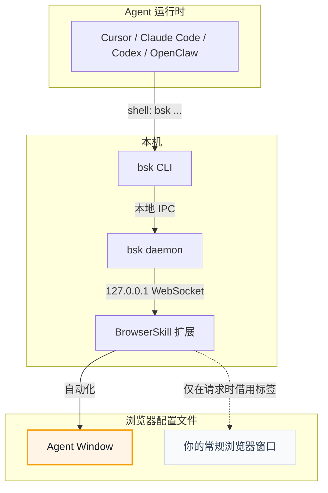

# BrowserSkill

<p align="center">
  
</p>

<p align="center">
  <strong>让 AI Agent 操作你的浏览器，而不打断你的工作。</strong>
</p>

<p align="center">
  <a href="README.md">English</a> · 中文
</p>

**BrowserSkill** 把 Cursor、Claude Code、Codex、OpenClaw、CodeBuddy、WorkBuddy、Pi、Hermes Agent、DeepSeek Harness 等 AI Agent 连接到你已登录的浏览器。

需要 Agent 操作你已打开的标签页？必须显式借用该标签，任务结束后归还，其余浏览器窗口不受影响。

https://github.com/user-attachments/assets/db782c92-b1d4-4aae-a255-039675937a90

## BrowserSkill 的优势

- **复用真实登录态**：Agent 可以操作你已经登录的网站，不需要额外测试账号。
- **不中断你的工作**：浏览器任务在独立可见的 Agent Window 中运行，不影响你继续使用自己的浏览器。
- **可显式接管当前标签页**：使用 `bsk session start --attach-current-tab` 时固定接管启动瞬间的活动标签页；若它是 `chrome://`、扩展页等受限页面，会在同一窗口创建 `about:blank` 工作标签页并返回 `fallback_created=true`。`bsk tab create` 可继续创建工作标签页并将会话重绑定到新 tab；原标签页与窗口都会保留。
- **支持任意 Agent**：只要 Agent 能调用 Shell，就可以通过 `bsk` CLI 使用 BrowserSkill，不绑定特定模型、Agent 框架或 harness。
- **内置 human-in-loop**：遇到 captcha、登录、确认弹窗等必须由人处理的步骤时，Agent 可以主动请求你接管，完成后再继续任务。

## 运行环境

BrowserSkill 由两个本地运行组件组成：`bsk` CLI/daemon 和浏览器扩展。

| 运行项 | 支持情况 |
| --- | --- |
| 操作系统 | macOS（Apple Silicon 和 Intel）、Linux（x64 和 ARM64）、Windows x64 |
| 浏览器 | 已支持 Chrome 和 Microsoft Edge；其他支持加载 Chromium 扩展的浏览器通常可用；Firefox 计划中 |

## 快速开始

<details open>
<summary><b>让 Agent 帮你安装（推荐）</b></summary>

<br>

已经在用 Cursor、Claude Code、Codex 或其他支持 Shell 的 Agent？只需复制下面这句话发给 Agent，它会帮你安装 CLI 和 skill，并引导你加载浏览器扩展：

```text
按照 https://raw.githubusercontent.com/Tencent/BrowserSkill/main/AGENT_INSTALL.md 的说明，在本机安装并配置 browser-skill
```

</details>

<details>
<summary><b>手动安装</b></summary>

<br>

先安装 CLI，再从 [Chrome Web Store](https://chromewebstore.google.com/detail/hhcmgoofomhgciiibhipgmgkgnoenaoi)
或 [Edge 加载项商店](https://microsoftedge.microsoft.com/addons/detail/browserskill/emacgiaaaiojkkpkddmmdfhmokgmnikg) 安装浏览器扩展。

#### 1. 安装 `bsk` CLI

**macOS / Linux**（推荐，安装到 `~/.local/bin`）：

```bash
curl -fsSL https://raw.githubusercontent.com/Tencent/BrowserSkill/main/install.sh | sh
```

**Windows**（PowerShell，安装到 `~/.local/bin`）：

```powershell
irm https://raw.githubusercontent.com/Tencent/BrowserSkill/main/install.ps1 | iex
```

验证二进制：

```bash
bsk --version
```

#### 2. 安装浏览器扩展

在对应浏览器的商店安装 BrowserSkill：

| 浏览器 | 商店页面 |
| --- | --- |
| Chrome | [Chrome Web Store](https://chromewebstore.google.com/detail/hhcmgoofomhgciiibhipgmgkgnoenaoi) |
| Microsoft Edge | [Edge 加载项商店](https://microsoftedge.microsoft.com/addons/detail/browserskill/emacgiaaaiojkkpkddmmdfhmokgmnikg) |

其他基于 Chromium 的浏览器，安装 Chrome Web Store 版本即可。

#### 3. 安装 skill

BrowserSkill 自带 skill，用于教 Agent harness 如何使用 `bsk`。以下 harness 可一键安装：

<p align="center">
<table>
  <tr>
    <td align="center" width="108"><a href="https://cursor.com" title="Cursor"></a><br /><sub><b>Cursor</b></sub></td>
    <td align="center" width="108"><a href="https://docs.anthropic.com/en/docs/claude-code" title="Claude Code"></a><br /><sub><b>Claude Code</b></sub></td>
    <td align="center" width="108"><a href="https://developers.openai.com/codex" title="Codex"></a><br /><sub><b>Codex</b></sub></td>
    <td align="center" width="108"><a href="https://openclaw.ai" title="OpenClaw"></a><br /><sub><b>OpenClaw</b></sub></td>
    <td align="center" width="108"><a href="https://www.codebuddy.ai" title="CodeBuddy"></a><br /><sub><b>CodeBuddy</b></sub></td>
    <td align="center" width="108"><a href="https://www.workbuddy.ai" title="WorkBuddy"></a><br /><sub><b>WorkBuddy</b></sub></td>
    <td align="center" width="108"><a href="https://github.com/badlogic/pi-mono" title="Pi"></a><br /><sub><b>Pi</b></sub></td>
    <td align="center" width="108"><a href="https://github.com/NousResearch/hermes-agent" title="Hermes Agent"></a><br /><sub><b>Hermes Agent</b></sub></td>
  </tr>
</table>
</p>

```bash
bsk install-skill
```

用 <kbd>Space</kbd> 选择需要安装的 Agent harness，然后按 <kbd>Enter</kbd> 安装 skill。运行 `bsk install-skill --list` 可查看 internal 变体及安装路径。

安装自定义指令可运行 `bsk install-skill --harness cursor --source ./SKILL.md`。
显式指定 `--source` 的安装始终视为自定义，即使内容与内置 skill 相同。
已有安装默认跳过，添加 `--force` 才会覆盖。

daemon 启动、`session start` 和 `doctor` 会检查已安装的 skill：只有文件内容仍与
上次安装或同步时的内容一致，才继续自动更新。检测到本地编辑时会保留文件并暂停更新。
没有内容基线的历史安装，只有与当前内置 skill 字节级一致时才自动纳入管理；此时只补齐
来源标记，不重写 `SKILL.md`。明确的自定义安装即使内容相同，也不会被自动纳入管理。

对于内容不同的历史文件、本地编辑或无法识别的来源标记，`doctor` 会显示 `WARN`，
说明暂停原因及恢复方法。这类警告不会让健康检查失败（`--json` 中为 `status: "warn"`、
`ok: true`）。其他安装或同步正在进行时，本次同步会推迟到后续再试。

如需将当前指令保留为明确的自定义安装，运行
`bsk install-skill --harness cursor --source <existing-SKILL.md> --force`，将
`<existing-SKILL.md>` 替换为现有文件路径。如需恢复内置 skill 并重新启用自动更新，运行
`bsk install-skill --harness cursor --force`，不带 `--source`。后一条命令会覆盖现有指令。

其他支持 Shell 的 Agent harness 也可使用 BrowserSkill，但需手动将 [`skill/SKILL.md`](skill/SKILL.md) 复制到对应 skills 目录下的 `browser-skill/SKILL.md`。DeepSeek Harness 走独立插件，见 [DeepSeek Harness 插件](#deepseek-harness-插件)。

</details>

启动一个新的 Agent 会话，写一条需要使用浏览器的 prompt，例如：

```text
/browser-skill open example.com and summarize what is on the page.
```

## DeepSeek Harness 插件

在用 [DeepSeek Harness](https://github.com/deepseek-ai/deepseek-harness)（`dsh`）？BrowserSkill 提供了官方 dsh 插件，已发布到 npm：[`@wxg-prc-cpg/browser-skill-dsh-plugin`](https://www.npmjs.com/package/@wxg-prc-cpg/browser-skill-dsh-plugin)。它为 Agent 提供原生 `browser_*` 工具，由插件代为调用 `bsk`，并在 Web UI 中实时展示浏览器会话。

先安装 `bsk` CLI 并连接浏览器扩展，再将插件装进 dsh profile 并启动（将 `web` 替换为你的 profile 名称）：

```sh
dsh plugin --profile web add @wxg-prc-cpg/browser-skill-dsh-plugin
dsh --profile web
```

插件自带 `browser-skill` skill，所以在 dsh 下无需执行 `bsk install-skill`。已安装的插件不会自动更新；升级此插件请运行：

```sh
dsh plugin --profile web update @wxg-prc-cpg/browser-skill-dsh-plugin --latest
```

升级后重启该 profile。用法与配置见[插件 README](packages/dsh-plugin-browserskill/README.md)。

## 工作原理

BrowserSkill 是 Agent 运行时与浏览器之间的本地桥接层。



Agent 不直接与浏览器通信。它通过 `bsk` CLI 下发浏览器任务；本地 daemon 把请求路由到扩展；扩展在 Agent Window 或显式绑定的当前标签页中执行。DeepSeek Harness 走同一条链路，只是经由 [插件](#deepseek-harness-插件)：Agent 调用注入的 `browser_*` 工具，由插件代为执行 `bsk`。

## 面向开发者

[scroll-to 原语说明](docs/scroll-to.md)介绍 CLI、协议和插件入口，以及可见区域、错误和中断语义。

本仓库是 Cargo + pnpm workspace：

- `crates/bsk-cli` — `bsk` CLI 与本地 daemon
- `crates/bsk-protocol` — 共享协议类型与 JSON Schema
- `apps/extension` — 浏览器扩展
- `packages/ui` 和 [`packages/i18n`](packages/i18n/README.md) — 扩展 UI 共享支持，包含英文、简体中文和韩语本地化
- `packages/dsh-plugin-browserskill` — DeepSeek Harness 插件（`@wxg-prc-cpg/browser-skill-dsh-plugin`）
- [`evals/browser`](evals/browser/README.zh-CN.md) — 确定性本地页面与 Agent 无关的浏览器能力测试台

## 许可证

MIT
